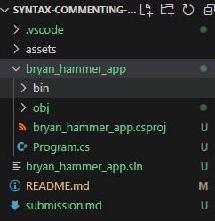

[](https://classroom.github.com/a/4x3oORCp)
[](https://classroom.github.com/online_ide?assignment_repo_id=11696861&assignment_repo_type=AssignmentRepo)
# Syntax and Commenting ICE
In this assignment you will create a basic program showcasing the concepts you learned about in the tutorial.

To submit this assignment, please perform the following:
1. Follow the instructions below.
1. Save your screenshots (if any) to the directory `assets`.
1. Link your screenshots (if any) in `submission.md` where appropriate.
1. Answer questions (if any) in `submission.md`.
1. Push your assignment to GitHub.

## Create your program (3 pts.)
Use the following steps to create your C# project. When you select the directory to save your project, place it in the directory for this GitHub repository. As an example, my GitHub repo is saved here:

> C:\Users\Bryan.Hammer\Documents\github\bmis365-bad-2023fall\syntax-commenting-ice

To do so, simply select the option `default directory` when prompted.

To begin, please create a C# project by performing the following using the Command Palette:
1. Open the Command Palette by using the shortcut keys `Ctrl + Shift + P`.
1. Find and select the `.NET: New Project` command by typing it.
1. After selecting the command, you'll need to choose the project template. Choose `Console app`.
1. Name the app `firstname_lastname_app` by typing in the text box. 
   1. For example, I would type `bryan_hammer_app`.
1. Select the default directory to create the files.

You should see something similar to this:



## Comments about me (3 pts.)
For this next step, you will edit the file `Program.cs` located in your app folder. Looking in the image above, it is located in the folder `bryan_hammer_app`.

Please perform the following:
1. Write a single line comment that contains your first and last name. (1 pt.)
1. Write a single line comment that contains your hometown, including state. (1 pt.)
1. Write a multi-line comment with the following: (1 pt.)
   1. On the first line, write about your favorite foods.
   1. On the second line, write about your favorite activity besides homework.
   1. On the third line, write the reason why you are interested in MIS.

## Syntax and style (4 pts.)
In this next section, you will take a moment to practice some of the syntax specific to C#. To do so, you will need to copy the following code into your `Program.cs` file.

```C#
int x = 20
int y = 18

if (x > y) 
{
console.writeline("Hello? Is this working?")
}
```

Please perform the following:
1. Indent the code `console.writeline("Hello? Is this working?")` using the `tab` key. (1 pt.)
1. Add the three missing semicolons. (2 pts.)
1. Correct the code `console.writeline("Hello? Is this working?")` so that it has the correct case. Three letters need to be made upper case. (1 pt.)
   1. Hint: The tutorial for this week has the correct spelling.